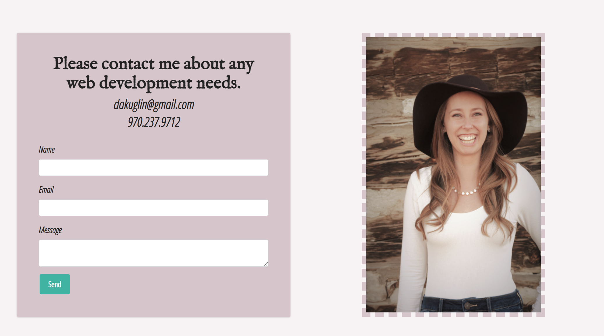
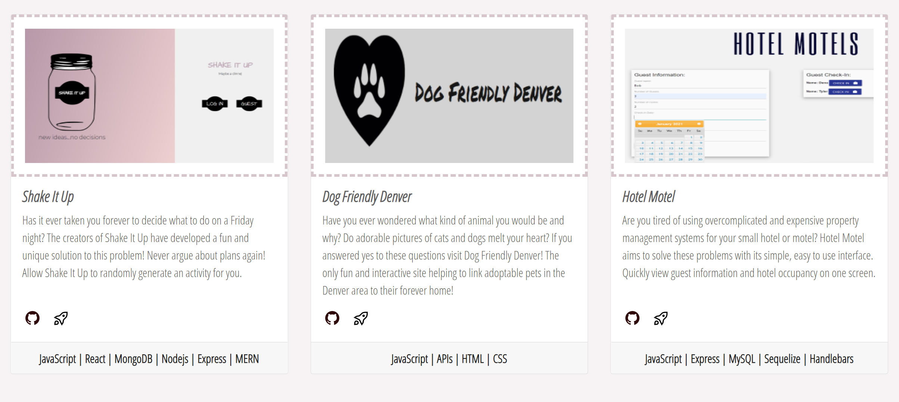
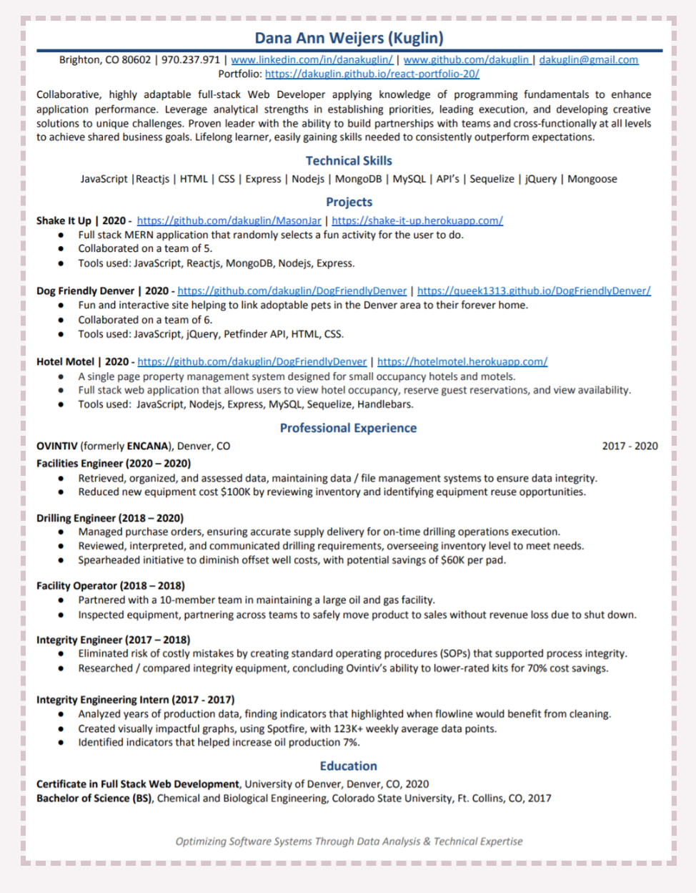

# dana-weijers-portfolio1

## Description 

This application is a portfolio containing information and links to recent projects I have made. In addition to showcasing my previous coding projects I also have my resume and links to my LinkedIn and GitHub accounts. Please take the time to view my portfolio, and please contact me with any questions about my previous work or job opportunities. 

My contact information can be found at the bottom of this readme or on my deployed version of my portfolio. You can also submit a contact form and I will get back to you shortly! Thank you. 

Technologies & Languages 
* JavaScript
* React 
* React Bootstrap
* Formspree 
* Mobile Responsive
* CSS / Styling

## Table of Contents 

* [Installation](#installation)
* [Usage](#usage)
* [Credits](#credits)
* [License](#license)
* [Questions](#questions)

## Installation

Steps to install my project include:
* npm install the dependencies 

## Usage 

 * When you first arrive to my deployed site you are directed to my about me page. I introduce myself and highlight the technologies and languages I know. You can visit my LinkedIn or GitHub accounts with links in the navbar. 

* My contact page contains a working form powered by Formspree. Please send me a message with any questions! 

* My portfolio page contains bootstrap cards that highlight previous applications and links to both the GitHub and deployed version of the application. 

* My resume contains all of my previous work experience, contact information, and education.  

## Credits

All of the code was developed by Dana Kuglin. Information about her GitHub profile and how you can contact her are listed below in the questions section. 

Some of the projects listed in my portfolio were developed with a team. Please use the GitHub links for each project to view contributors for specific projects in the README. 

## License

This project is licensed under MIT.

## Questions

GitHub Username: dakuglin
GitHub Profile: (https://github.com/dakuglin)

Please email me with additional questions at dakuglin@gmail.com